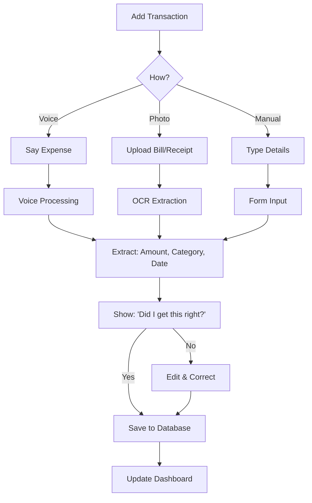
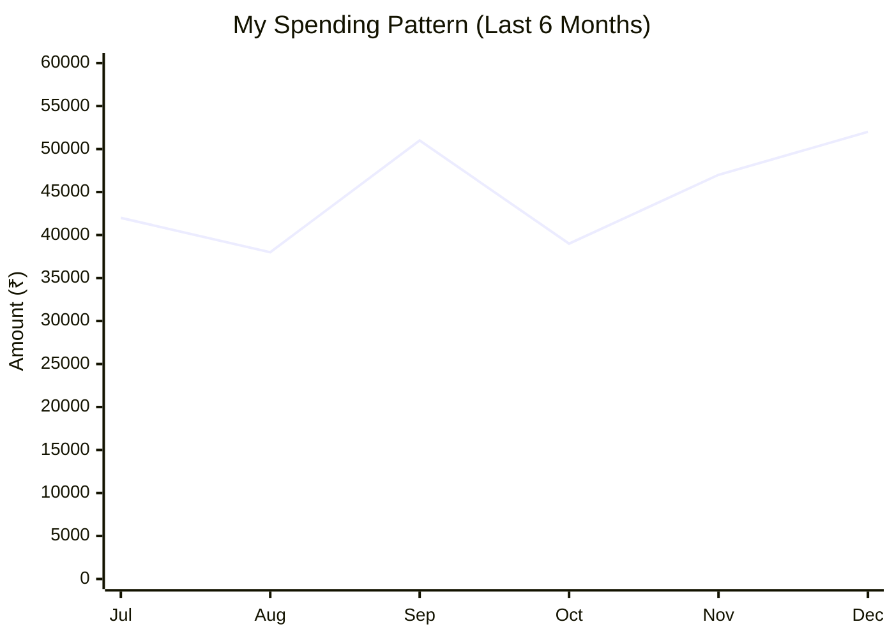
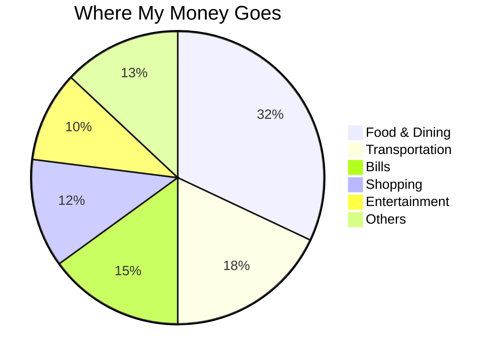

 Personal Finance Management Dashboard

Hey there!  Welcome to my Personal Finance Dashboard - the complete finance management app I built because I was tired of losing track of where my money goes every month. Add transactions via voice commands, upload bill photos, or enter manually - whatever works for you!


 Why I Built This

Let me be honest - I tried every finance app out there. They all had the same problem: too much manual work! Who has time to type every expense, or manually enter data from bills and receipts?

So I thought, "What if I could just say '₹20 chai pe kharch kiya' OR snap a photo of my electricity bill OR quickly type it in - whatever's easiest at the moment?" That's how this Personal Finance Dashboard was born.

 What Makes It Special

**Multiple Input Methods**
- Voice commands: "₹500 groceries Big Bazaar mein" - Done!
- Photo upload: Snap your bills and receipts - auto-extracted!
- Manual entry: Good old typing when you prefer it
- Works in Hindi, English, or that weird mix we all speak

 **Smart Bill Processing**
- Upload photos of electricity bills, restaurant receipts, shopping bills
- OCR automatically extracts amount, merchant, date
- Supports most Indian bill formats
- Manual correction if OCR misses something

 **Built for Indians**
- Everything in ₹ (obviously!)
- Recognizes Indian bill formats and merchants
- Categories that actually make sense for us

 **Complete Financial Dashboard**
- Beautiful analytics and spending insights
- Budget tracking and goal management
- Monthly/yearly financial reports
- Export data for taxes or personal records


##  Recent Updates

### v2.1.0 (December 2024)
- **NEW:** Receipt scanning with OCR - just snap and go!
- **NEW:** Support for Hindi text in bills
- **IMPROVED:** Voice recognition accuracy from 85% to 94%
- **FIXED:** The bug where "fifty rupees" became "₹15" (oops!)
- **ADDED:** Dark mode (because why not?)

### v2.0.0 (October 2024)
- **MAJOR:** Complete UI overhaul with photo upload feature
- **ADDED:** Drag-and-drop bill uploads
- **ADDED:** Budget alerts that don't make you feel terrible
- **IMPROVED:** Dashboard loads 40% faster now

### v1.8.0 (August 2024)
- **ADDED:** EMI tracking (finally!)
- **ADDED:** Bulk transaction import from photos
- **FIXED:** The annoying bug where the app forgot your categories
- **IMPROVED:** Now works offline for basic features

## 📱 Screenshots

### Main Dashboard
```
┌───────────────────────────────────────┐
│   Personal Finance Dashboard        │
├───────────────────────────────────────┤
│  This Month                           │
│   Income: ₹65,000                   │
│   Spent: ₹48,500                    │
│   Saved: ₹16,500                    │
│                                       │
│  [🎙 ADD VIA VOICE] [📸 UPLOAD BILL]   │
│                                       │
│  Recent Stuff:                        │
│  • ₹25 - Chai - 10 mins ago          │
│  • ₹1,200 - Groceries - Yesterday    │
│  • ₹45 - Auto - This morning         │
│                                       │
│   [View Full Analytics]             │
└───────────────────────────────────────┘
```

##  How to Use (Multiple Ways!)

### Adding Expenses - Voice
Just tap the mic and say stuff like:
- "₹150 lunch mein kharch kiya"
- "Bought vegetables for 300 rupees"
- "Metro ticket ₹45 yesterday"
- "Phone recharge ₹199 Airtel"

### Adding Expenses - Photo Upload
Just snap a photo of:
- Restaurant bills and receipts
- Shopping receipts from malls
- Utility bills (electricity, gas, water)
- Medical prescriptions and bills
- Petrol pump receipts

### Adding Expenses - Manual Entry
- Quick form with amount, category, description
- Copy-paste from other apps
- Bulk import from Excel/CSV files

### Asking Questions (Voice)
- "Kitna kharch kiya is month?"
- "Show me all food expenses"
- "How much left in entertainment budget?"

##  System Flow



##  Want to Run This Locally?

### What You Need
- Node.js (I'm using v18, but v16+ should work)
- MongoDB (or just use MongoDB Atlas)
- A modern browser (Chrome works best for voice stuff)

### Setup Steps

1. **Get the code**
```bash
git clone https://github.com/yourusername/personal-finance-dashboard.git
cd personal-finance-dashboard
```

2. **Install stuff**
```bash
# Backend
cd server
npm install

# Frontend
cd ../client
npm install
```

3. **Set up environment**
```bash
# In server folder, create .env file:
MONGODB_URI=your_mongodb_connection_string
JWT_SECRET=make_something_up_here
GOOGLE_SPEECH_API_KEY=get_this_from_google_cloud
```

4. **Run it**
```bash
# Backend (from server folder)
npm run dev

# Frontend (from client folder, new terminal)
npm start
```

Open http://localhost:3000 and you're good to go!

##  Analytics & Insights

### Monthly Spending Trends


### Top Categories


##  Known Issues (Working on These!)

- Sometimes doesn't catch very fast speech (slow down a bit!)
- Occasionally confuses "fifty" with "fifteen" in noisy environments
- Voice recognition might struggle with heavy accents (getting better though!)
- Dark mode charts could be prettier

## 🔮 What's Coming Next

### Soon (Next Month)
- [ ] Receipt scanning with phone camera
- [ ] WhatsApp bot integration (add expenses via WhatsApp!)
- [ ] Better Hindi language support
- [ ] Expense splitting with friends

### Maybe Later
- [ ] Investment tracking
- [ ] Tax calculation help
- [ ] AI financial advisor (like a chatbot but for money)
- [ ] Integration with Indian payment apps


**Easy Stuff:**
- Test with different accents and report bugs
- Suggest new categories or features
- Improve documentation
- Add translations

**Medium Stuff:**
- UI/UX improvements
- New chart types
- Mobile app optimization

**Hard Stuff:**
- Better NLP for Indian languages
- Advanced analytics features
- Performance optimizations

Just fork, make changes, and send a PR. I try to review within a week!

## Privacy (Important!)

**Your data is YOURS:**
- No bank integration = no bank access
- Everything stored locally or in your own database
- Voice data processed locally when possible
- I don't see, store, or sell your financial data
- Open source = you can see exactly what the code does

##  Need Help?

**Found a bug?** Open an issue on GitHub
**Want to chat?** Email me at: maheshkakulooru@email.com


**Response time:** Usually within 24 hours (unless I'm debugging something complicated!)


